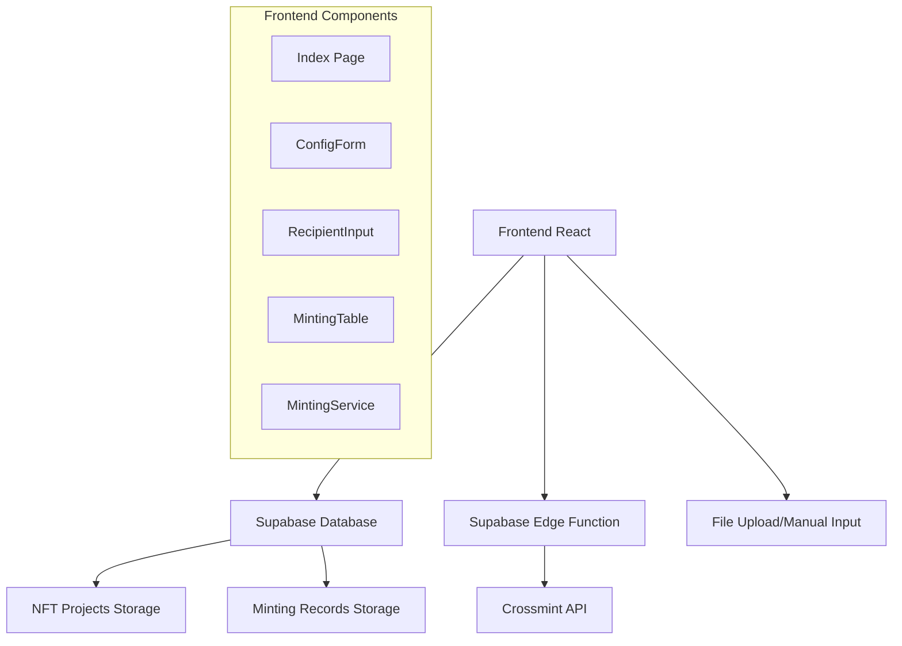
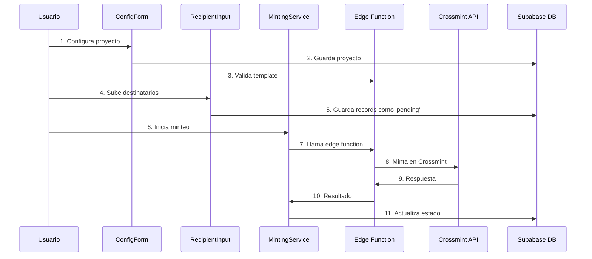

# 🏗️ ARQUITECTURA GENERAL



---

# 🧩 COMPONENTES PRINCIPALES Y SUS FUNCIONES

## 1. Index.tsx - Componente Principal
**Función:** Orquesta toda la aplicación

**Responsabilidades:**
- Gestiona el estado global (mintingRecords, selectedRecords, currentProject)
- Carga proyectos existentes desde Supabase al iniciar
- Coordina la comunicación entre todos los componentes
- Maneja la lógica de selección masiva y operaciones en lote

## 2. ConfigForm.tsx - Configuración de Proyectos
**Función:** Permite crear y gestionar proyectos de NFT

**Responsabilidades:**
- CRUD de proyectos NFT (nombre, API key, template ID, collection ID, blockchain)
- Validación en tiempo real del Template ID usando edge function
- Detección automática de blockchain basada en el template
- Selector de proyectos existentes vs. crear nuevo

## 3. RecipientInput.tsx - Entrada de Destinatarios
**Función:** Permite ingresar destinatarios de NFTs

**Responsabilidades:**
- Entrada manual (textarea) o carga de archivos
- Validación de formato (emails vs. wallet addresses)
- Detección de incompatibilidades blockchain/wallet
- Guardado automático en Supabase con project_id

## 4. MintingTable.tsx - Tabla de Resultados
**Función:** Muestra el estado de las operaciones de minteo

**Responsabilidades:**
- Visualización de registros con iconos de estado (🟡🟢🔴)
- Selección múltiple con checkboxes
- Acciones individuales (retry, delete)
- Formato inteligente de destinatarios (truncado)

## 5. MintingService.ts - Lógica de Negocio
**Función:** Servicio que maneja toda la lógica de minteo

**Responsabilidades:**
- mintNFT(): Minta NFT individual vía edge function
- processMultipleMints(): Procesa lotes con límite de concurrencia (5 simultáneos)
- Gestión de estados en base de datos
- Manejo de errores y reintentos

---

# 🔄 FLUJO DE TRABAJO COMPLETO



---

# 🌐 INTEGRACIÓN CON CROSSMINT

**Edge Function (`supabase/functions/crossmint-nft/index.ts`)**
- Proxy seguro entre frontend y Crossmint API
- Formateo automático de destinatarios:
  - Emails: `email:usuario@ejemplo.com:blockchain`
  - Wallets: `blockchain:0x123...`
- Ajuste automático de blockchain (ej: chiliz → chiliz-spicy-testnet)
- Manejo de errores detallado
- Headers CORS configurados
- Llamada a Crossmint API

**Ejemplo de llamada:**

```
POST https://staging.crossmint.com/api/2022-06-09/collections/{collectionId}/nfts
{
  "recipient": "email:user@example.com:chiliz-spicy-testnet",
  "templateId": "47bdeb30-f082-4c74-a02b-02bee1f8a49f"
}
```

---

# 🗃️ ESTRUCTURA DE BASE DE DATOS

**Tabla: nft_projects**
- id, name, api_key, template_id, collection_id, blockchain, created_at

**Tabla: nft_mints**
- id, recipient, status ('pending'|'minted'|'failed'), error_message, project_id, template_id, created_at, updated_at

---

# ⚙️ CARACTERÍSTICAS TÉCNICAS CLAVE

## 1. Validación en Tiempo Real
- Template validation usando edge function validate-template
- Detección automática de blockchain del template
- Advertencias de incompatibilidad wallet/blockchain

## 2. Procesamiento Eficiente
- Concurrencia limitada (5 mints simultáneos)
- Actualización de UI en tiempo real
- Manejo robusto de errores

## 3. Gestión de Estados
- Estados: pending → minted | failed
- Persistencia en Supabase
- Capacidad de retry para fallos

## 4. UX Mejorada
- Selección masiva inteligente
- Formateo de direcciones truncadas
- Tooltips con errores detallados
- Estadísticas en tiempo real

---

# 🔧 PUNTOS IMPORTANTES PARA DESARROLLO

- **Collection ID vs Template ID:** El Collection ID se usa en la URL del endpoint, el Template ID se envía en el body
- **Blockchain Auto-adjustment:** La app ajusta automáticamente blockchains para testnets
- **Error Handling:** Sistema robusto de manejo de errores con logging detallado
- **Concurrency Control:** Límite de 5 operaciones simultáneas para evitar rate limiting
- **Data Persistence:** Todo se guarda en Supabase para recuperación y auditoria

---

Esta aplicación es una herramienta completa para equipos que necesitan enviar NFTs masivamente usando Crossmint, con una interfaz intuitiva y manejo robusto de errores.

---

# 💡 RECOMENDACIONES PARA DESARROLLO LOCAL Y COMMITS

## Tech Stack

**Frontend:**
- React 18.3.1
- TypeScript 5.5.3
- Vite 5.4.1
- Tailwind CSS 3.4.11
- shadcn/ui (Radix UI)
- React Router DOM 6.26.2
- React Hook Form + Zod
- TanStack Query
- Recharts

**Backend:**
- Supabase (PostgreSQL + Edge Functions)
- Crossmint API

## Recomendaciones para Desarrollo Local

1. **Setup Inicial**
   ```sh
   git clone <repo-url>
   cd <project-name>
   npm install
   npm run dev
   ```

2. **Estructura de Branches y Commits**
   - Crear feature branches para cada nueva funcionalidad:
     ```sh
     git checkout -b feature/nombre-feature
     git checkout -b fix/nombre-bug
     ```
   - Commits descriptivos siguiendo convenciones:
     ```sh
     git commit -m "feat: añadir validación de template ID"
     git commit -m "fix: corregir error en minting batch"
     git commit -m "refactor: reorganizar componentes de UI"
     ```

3. **Sincronización con Lovable**
   - Los cambios locales se reflejan automáticamente en Lovable
   - Los cambios en Lovable se sincronizan al repo

4. **Variables de Entorno**
   - Configurar las variables de Supabase:
     ```env
     VITE_SUPABASE_URL=https://ikuviazxpqpbomfaucom.supabase.co
     VITE_SUPABASE_ANON_KEY=eyJhbGciOiJIUzI1NiIsInR5cCI6IkpXVCJ9...
     ```

5. **Mejores Prácticas de Código**
   - Mantener componentes pequeños y enfocados
   - Usar TypeScript interfaces para props
   - Seguir la estructura de carpetas existente
   - Usar React Query para datos del servidor
   - useState para estado local
   - Props drilling mínimo, considerar Context si es necesario
   - Usar clases de Tailwind CSS y shadcn/ui
   - Mantener consistencia con componentes existentes

6. **Testing y Validación Local**
   - Verificar que compile sin errores:
     ```sh
     npm run build
     npm run lint
     ```
   - Testear funcionalidad crítica:
     - Configuración de proyectos
     - Carga de recipients
     - Proceso de minting
     - Validación de templates

7. **Flujo de Trabajo Recomendado**
   - Pull latest changes antes de empezar
   - Crear feature branch
   - Desarrollar y testear localmente
   - Commit frecuente y descriptivo
   - Push a GitHub (se sincroniza con Lovable)
   - Pull Request para review
   - Merge a main tras approval

8. **Áreas Críticas del Código**
   - No tocar sin cuidado:
     - `src/services/MintingService.ts`
     - `supabase/functions/crossmint-nft/index.ts`
     - `src/integrations/supabase/`
   - Más seguro para cambios:
     - Componentes UI individuales
     - Estilos y layouts
     - Validaciones de formularios
     - Componentes de presentación

9. **Debugging y Logs**
   - Usar `console.log` para debugging
   - Revisar Network tab para errores de API
   - Monitorear Supabase logs para Edge Functions

10. **Dependencias**
    - NO cambiar versiones principales sin consultar
    - Si agregás dependencias, documentá el por qué
    - Usar `npm install` (no yarn) para consistencia

---

Esta aplicación es robusta pero tiene integraciones complejas (Supabase + Crossmint), así que cualquier cambio en la lógica de minting o configuración de APIs debe ser testeado exhaustivamente. 